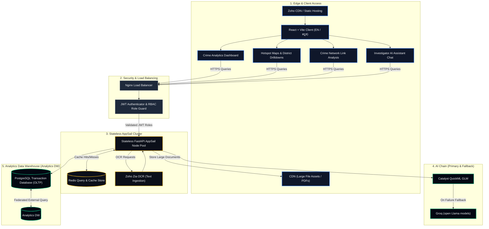
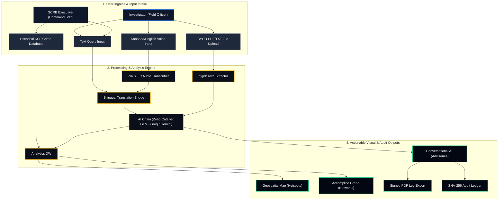

# Vyuha Network — AI-Driven Crime Analytics & Visualization Platform
*Karnataka State Police (KSP) · State Crime Records Bureau (SCRB) decision-support suite*

Vyuha Network turns fragmented FIR records into actionable intelligence. It gives
investigators and the SCRB interactive dashboards, geospatial hotspot maps,
district drilldowns, criminal link analysis, predictive recidivism scoring, and a
bilingual (English / **ಕನ್ನಡ**) AI assistant — all over the **official Karnataka
Police FIR database schema**.

Built on and **deployed to Zoho Catalyst** (AppSail + Web Client Hosting), with
Catalyst AI (Zia OCR, GLM chat) wired in.

> **Live (Catalyst development env)**
> - App: `https://vyuha-network-60080167463.development.catalystserverless.in/app/index.html`
> - API: `https://vyuha-api-50044361539.development.catalystappsail.in`
> - Developer console: `…/app/admin`
> - Logins: `officer / officer123` · `admin / admin123` · `executive / executive123`

## Technology Stack

### Backend Services
*   **API Framework**: FastAPI (Python 3.12/3.14 stateless REST API).
*   **ASGI Server**: Uvicorn (production-grade asyncio worker process).
*   **Database ORM**: SQLAlchemy 2.0 (relational mapping and transactions).
*   **Database Engines**: PostgreSQL (durable production database) / SQLite (development fallback).
*   **PDF Compiler**: ReportLab (generates secure investigation logs).
*   **Document Processing**: PyPDF (extracts text from uploaded PDF case files).

### Artificial Intelligence & Cognitive Services
*   **Primary LLM Engine**: Zoho Catalyst QuickML GLM (chat analysis, translations, and pattern queries).
*   **Cognitive Services (OCR)**: Zoho Catalyst Zia Services (text extraction from scanned case papers).
*   **Fallback LLM Engine**: Groq API / Llama-3-8b (secondary model tier).
*   **Legacy LLM Engine**: Google Gemini 1.5 Flash (fallback model tier).

### Frontend Dashboard Client
*   **Client Core**: React 18.3 & TypeScript 5.2.
*   **Bundler**: Vite 5.2 (fast production compilation).
*   **Geospatial GIS Map**: Leaflet.js (dark-tiles spatial map).
*   **Graphics Engine**: Custom HTML5 2D Canvas (runs Verlet physics accomplice networks).
*   **Styling Theme**: Vanilla HSL CSS with Glassmorphism properties.
*   **Icons**: Lucide Icons.

### Deployment & Infrastructure (Zoho Catalyst Ecosystem)
*   **Serverless Hosting**: Zoho Catalyst Cloud Serverless platform.
*   **Docker Container Hosting**: Zoho Catalyst AppSail (stateless backend hosting).
*   **Web Client Hosting**: Zoho Catalyst client-site hosting (serves built React SPA).
*   **Identity & OAuth Provider**: Zoho Accounts (handles API credentials and token refreshing).

---

## Key features

- **Command overview** — SQL-aggregated KPIs, weekly incident trend, gravity split
  (Heinous vs non-heinous), case-status pipeline, district pressure, crime-head volumes.
- **Geospatial hotspots** — Karnataka-only Leaflet map (rest of the map masked),
  incident + density layers, district polygons, click-a-district to filter/zoom,
  and a full FIR case drawer (CrimeNo, gravity, acts & sections, IO, court,
  chargesheet outcome, complainant profile).
- **Criminal link analysis** — canvas force-graph inferred from co-accused
  relationships; hub detection, risk-banded nodes, zoom-to-spread, AI risk panel.
- **Offender registry & dossiers** — identity-resolved from accused records,
  paginated, predictive recidivism scoring; printable per-offender dossier (crime
  history, arrests, chargesheets, crime-head breakdown, acts, associates).
- **Correlation analytics** — complainant occupation × crime-head and community ×
  crime-head, with auto-generated analyst notes.
- **Bilingual AI assistant** — chat grounded in the live FIR DB, real LLM
  responses, sentiment/keyword enrichment, hash-verified audit ledger, PDF export,
  and a Zia-OCR "scan document" intake.
- **Full Kannada / English UI** — a topbar toggle (`EN | ಕನ್ನಡ`) switches the whole
  interface; the choice persists.
- **Developer console (`/admin`)** — admin-gated: live metrics (API/AI/OCR calls),
  runtime environment editor (set keys without redeploying), and a log tail.
- **Light / dark themes** throughout.

## Operational Opportunities & Impact

### 📈 Command Overview Page (Strategic Oversight)
*   **Operational Opportunity**: **Instant Executive Oversight & Performance Tracking**
*   **The Value**: Instead of spending days consolidating physical ledgers and spreadsheets across 1100+ stations, police leaders get an immediate visual health report of state-level security.
*   **Real-World Impact**: Enables command staff to identify crime spikes, track station case resolution throughput, and adjust regional deployments immediately.

### 🗺️ Geospatial Hotspot Map (Tactical Navigation)
*   **Operational Opportunity**: **Proactive Patrol Routing & Resource Placement**
*   **The Value**: Replaces legacy text address lists with a live, zoomable crime-density map showing crime hotbeds, search filters, and case details.
*   **Real-World Impact**: Allows precinct planners to direct patrol cars to active risk zones, preventing offenses before they occur and decreasing local emergency response times.

### 🕸️ Criminal Link Analysis (Accomplice Graph)
*   **Operational Opportunity**: **Dismantling Syndicates & Intercepting Ring Leaders**
*   **The Value**: Exposes hidden networks of accomplices by mapping co-arrest records visually. Flags core "hubs" (repeat offenders linking separate gangs) and maps recidivism risks.
*   **Real-World Impact**: Empowers investigators to dismantle entire crime networks rather than making isolated arrests.

### 📊 Correlation & Demographic Analytics (Community Policing)
*   **Operational Opportunity**: **Targeted Crime Prevention & Local Interventions**
*   **The Value**: Maps offense trends against demographics (e.g. complainant occupation or local district metrics).
*   **Real-World Impact**: Directs municipal and social support programs directly to high-risk zones, addressing root causes of crime like youth unemployment.

### 🗣️ Bilingual AI Assistant (Voice Command)
*   **Operational Opportunity**: **Democratizing Investigation Access for Field Staff**
*   **The Value**: Direct voice query support in spoken Kannada or English (e.g. *"Show me recent homicides near Bengaluru"*).
*   **Real-World Impact**: Saves hours of database lookups, giving every beat officer instant, voice-activated access to case records in their native language.

---

## Architecture



---

## Process Flow & Use-Case Diagram



### AI chain (`backend/app/services/ai_service.py`)

Selection is a graceful chain — each tier falls back to the next on any error:

1. **Catalyst QuickML GLM** (primary) — set `CATALYST_AI_TOKEN`.
2. **Groq** (OpenAI-compatible, free open models) — set `FALLBACK_AI_*`.
3. **Gemini** — legacy, if `GEMINI_API_KEY` and mock not forced.
4. **Heuristic mock** — zero-config default.

JSON parsing tolerates code fences and `<think>` reasoning blocks. Keys are set at
runtime via the `/admin` console (or the Catalyst console) — never committed.

### Catalyst AI features

- **Zia OCR** — installed as a Catalyst Function via the Zia Services CodeLib; the
  backend calls it server-to-server so the secret never reaches the browser.
- **Catalyst GLM** — the primary chat/analysis model (see chain above).

---

## Data model — official Karnataka Police FIR schema

The backend implements the full FIR ER schema (see
[`docs/fir-schema.md`](docs/fir-schema.md)) — ~25 tables including:

- **CaseMaster** — the FIR, with the 18-digit structured `CrimeNo`
  (`category + district + unit + year + serial`), gravity, crime head/sub-head,
  status, court, lat/long, brief facts.
- **People** — `ComplainantDetails`, `Victim`, `Accused` (+ `ArrestSurrender` and
  the `inv_arrestsurrenderaccused` junction).
- **Legal** — `Act`, `Section`, `ActSectionAssociation`; **classification** —
  `CrimeHead`, `CrimeSubHead`; **outcome** — `ChargesheetDetails`.
- **Org / geography** — `Employee`, `Unit`, `UnitType`, `Court`, `District`,
  `State`, `Rank`, `Designation`, and lookups (Caste/Religion/Occupation,
  CaseCategory, GravityOffence, CaseStatusMaster).

Offenders and the criminal network are **inferred** (there is no global person
table in the schema): accused are resolved across cases by a stable key, and the
network is built from co-accused on shared cases.

**Persistence:** SQLite is the zero-config local default; set `DATABASE_URL` to a
Postgres instance for durable, shared data (verified — the app is Postgres-ready,
with dialect-aware queries). AppSail is stateless, so a bundled SQLite reseeds on
redeploy; `AUTO_SEED` is idempotent.

---

## Directory structure

```
Vyuha-Network/
├── README.md
├── DEPLOYMENT.md              # Zoho Catalyst deploy guide (verified)
├── catalyst.json             # client + appsail + functions
├── docs/
│   ├── fir-schema.md         # official FIR ER schema (implemented)
│   ├── zoho-catalyst-research.md
│   └── screenshots/
├── client/                   # Web Client Hosting (built SPA + client-package.json)
├── functions/
│   └── catalyst-zia-services/  # Zia OCR CodeLib (Catalyst Function)
├── scripts/build-client.sh   # build frontend → client/
├── backend/                  # FastAPI (AppSail, Docker)
│   ├── Dockerfile
│   ├── catalyst_server.py    # entrypoint; binds X_ZOHO_CATALYST_LISTEN_PORT
│   ├── app/
│   │   ├── main.py           # app, CORS, metrics middleware, startup seed
│   │   ├── db/models.py      # full FIR schema (SQLAlchemy)
│   │   ├── api/              # auth, analytics, network, chat, intel, admin
│   │   ├── services/         # ai_service, catalyst_ai, offender_analytics,
│   │   │                     #   network_service, observability, pdf_service
│   │   └── scripts/seed_data.py
│   └── requirements.txt
└── frontend/                 # Vite + React + TypeScript
    └── src/
        ├── App.tsx           # routes (incl. self-gated /admin)
        ├── context/          # Auth, Theme, Language (EN/ಕನ್ನಡ)
        ├── lib/i18n.ts       # bilingual UI strings
        ├── components/       # ui/, layout/, charts/
        └── features/         # dashboard, map, network, analytics,
                              #   offenders, assistant, admin, auth
```

---

## Local setup

### Backend (Python 3.12)

```bash
python3 -m venv backend/.venv
backend/.venv/bin/pip install -r backend/requirements.txt

# seed the local SQLite DB (idempotent)
cd backend && ../backend/.venv/bin/python -m app.scripts.seed_data

# run the API
.venv/bin/uvicorn app.main:app --reload --port 8000
```

Zero-config: falls back to `sqlite:///./vyuha_crime.db` and the heuristic mock AI.
To enable real AI locally, export `FALLBACK_AI_API_KEYS` (a free Groq key) or
`CATALYST_AI_TOKEN`; for Postgres, set `DATABASE_URL`.

### Frontend

```bash
cd frontend
npm install
npm run dev            # http://localhost:5173 (proxies /api → :8000)
```

---

## Deploying to Zoho Catalyst

Full, verified walkthrough in **[DEPLOYMENT.md](DEPLOYMENT.md)**. In short:

```bash
npm install -g zcatalyst-cli && catalyst login && catalyst init

# backend → AppSail (Docker)
cd backend && docker build --platform linux/amd64 -t vyuha-api:latest -t localhost/vyuha-api:latest . && cd ..
catalyst appsail:add --name vyuha-api --source "docker://localhost/vyuha-api:latest"
catalyst deploy --only appsail

# Zia OCR CodeLib (Catalyst Function)
catalyst codelib:install https://github.com/catalystbyzoho/codelib-zia-services
catalyst deploy --only functions

# frontend → Web Client Hosting (served under /app)
printf 'VITE_API_BASE_URL=<AppSail URL>\nVITE_CATALYST_AI=true\n' > frontend/.env.production
./scripts/build-client.sh && catalyst deploy --only client
```

Set runtime config (AI/OCR keys, `DATABASE_URL`) in **`/admin` → Environment** or
the Catalyst console — secrets are never committed or baked into the image.

---

## Quality checks

- **Frontend:** `npm run typecheck` · `npm run lint` · `npm run build` (in `frontend/`)
- **Backend:** `pytest` · `black --check app/` · `flake8 app/` · `mypy app/` (in `backend/`)

---

## Datathon Submission Resources

### 📋 Technology Stack Textbox List (Plain Text Copy-Paste)
```text
Backend: Python 3.12/3.14, FastAPI, Uvicorn, SQLAlchemy 2.0 ORM, PostgreSQL (production) / SQLite (development). AI/LLM: Zoho Catalyst QuickML GLM, Groq API (Llama-3-8b fallback), Google Gemini 1.5 Flash, Zoho Catalyst Zia Services (OCR Function). Processing: PyPDF (text extractor), ReportLab (PDF compiler). Frontend: React 18.3, TypeScript 5.2, Vite 5.2, Leaflet.js (GIS Map), HTML5 Canvas 2D (Verlet physics graph), Lucide Icons, HSL CSS with Glassmorphism. Deployment: Zoho Catalyst AppSail (Docker container hosting), Web Client Hosting.
```

### 🖼️ Visual Feature Reference Table
| System Module | Operational Capability | Primary Tech Utilized | File/Code Reference |
| :--- | :--- | :--- | :--- |
| **Backend Core Engine** | ACID Transactions, role-based JWT auth, and paginated routes | Python 3.12/3.14, FastAPI, Uvicorn, SQLAlchemy 2.0 ORM, PostgreSQL / SQLite | [main.py](backend/app/main.py) |
| **Frontend Client Core** | Localized EN/KN Single Page Application (SPA) dashboard client | React 18.3, TypeScript 5.2, Vite 5.2, HSL CSS (Glassmorphism), Lucide Icons | [App.tsx](frontend/src/App.tsx) |
| **Deployment & hosting** | Stateless AppSail containers scaling and static web assets serving | Zoho Catalyst AppSail (Docker hosting), Web Client Hosting | [catalyst.json](catalyst.json) |
| **Command Overview** | Real-time KPIs, incident trends, & socio-economic correlations | SQL aggregations, custom CSS charts | [analytics.py](backend/app/api/analytics.py) |
| **Geospatial Map** | Clustered hotspot coordinates & district-level filters | Leaflet.js GIS, custom dark-tile masking | [map.js](frontend/src/features/dashboard/map.js) |
| **Accomplice Graph** | Force-directed accomplice lines & offender hub highlights | Custom HTML5 Canvas Verlet physics | [ForceGraph.tsx](frontend/src/features/network/ForceGraph.tsx) |
| **Bilingual Assistant** | Speech-to-text queries in EN/KN with signed PDF ledger exports | Zoho Catalyst QuickML GLM, Zia STT, translation bridge, ReportLab | [ai_service.py](backend/app/services/ai_service.py) |
| **Zia Document Ingestion** | Extracts text from scanned paper case logs server-to-server | Zoho Catalyst Zia Services (OCR Function) | [catalyst-zia-services](functions/catalyst-zia-services) |
| **BYOD Intake** | Drag-drop files processing & document-specific context Q&A | Decoupled server, `pypdf`, SQLite | [documents.py](backend/app/api/documents.py) |
| **Admin Console** | Key configuration changes at runtime & logs streaming | FastAPI SSE, Zoho Catalyst AppSail Config Manager | [admin.py](backend/app/api/admin.py) |

