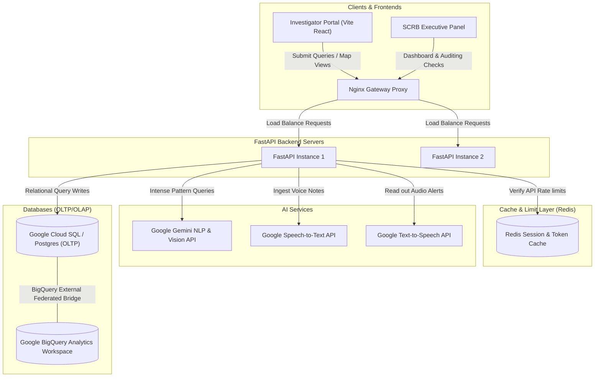

# Vyuha Network - AI-Driven Crime Analytics & Conversational Intelligence Platform
*Karnataka State Police (KSP) Decision-Support & Criminal Intelligence System*

Vyuha Network is an enterprise-ready, intelligence-grade analytics and conversational platform. It empowers police investigators and the State Crime Records Bureau (SCRB) of Karnataka to search, filter, and analyze fragmented records from 1100+ police stations in real-time. It maps criminal associations, highlights hot spots geographically, scores recidivism risks, and answers queries in English and Kannada via an audit-tracked conversational interface.

---

## Key Features

*   **Interactive Geospatial Maps**: Visualizes crime clusters, hotspots, and district-level drilldowns utilizing Leaflet mapping overlays.
*   **Geospatial & Socio-Economic Correlation**: Overlays district demographic data with crime statistics to reveal correlations with employment, literacy, and land parameters.
*   **Criminal Network & Link Analysis**: Renders interactive association graphs showing partnerships, co-offender status, and crime-ring associations using interactive graph visualizers.
*   **Bilingual Chat Assistant (English & Kannada)**: Supports voice and text conversations to query KSP crime records, translate questions, and summarize legal details in both English and Kannada.
*   **Explainable AI & Audit Trails**: Generates structured chain-of-thought reasonings explaining risk scores, backed by strict cryptographic auditing hashes saved per query.
*   **Audit-Ready PDF Exporting**: Packages query histories, active investigation charts, and network graphs into signed PDFs for case evidence binders.

---

## System Architecture

The following diagram illustrates how incoming inquiries and telemetry requests are load-balanced, authenticated via JWT/RBAC, queried, and processed using standard police records databases:



---

## AI & Machine Learning Module Architecture

`ai_service.py` is the core parsing engine of Vyuha Network. It interfaces with Google Gemini to process voice logs, resolve text semantics, and build graphs:

```
                   ┌──────────────────────────────────────────┐
                   │    Intake (Chat / Voice Query / Search)  │
                   └────────────────────┬─────────────────────┘
                                        │
                                        ▼
                   ┌──────────────────────────────────────────┐
                   │               ai_service.py              │
                   └──────┬─────────────┬──────────────┬──────┘
                          │             │              │
         ┌────────────────┴┐    ┌───────┴────────┐    ┌┴────────────────┐
         │   Audio Parser  │    │  Link Analyzer │    │  Anomaly Engine │
         │  (stt_service)  │    │(network_service)│    │(predictive_svc) │
         └─────────────────┘    └────────────────┘    └─────────────────┘
```

### Module Directory & Roles

1.  **`ai_service.py` (Gemini Orchestrator)**: Parses raw user inputs, extracts entities (names, IPC sections, dates), determines intention, and responds in the target language (English/Kannada).
2.  **`network_service.py` (Link-Analysis Engine)**: Extracts relational co-occurrences of suspect mentions across FIR reports, building interactive graph metrics (degree centrality, sub-clique groups).
3.  **`predictive_service.py` (Recidivism Risk & Hotspots)**: Models statistical probabilities of offender recidivism using scoring indices based on crime patterns, geo-velocity, and demographics.
4.  **`translation_service.py` (Bilingual Bridge)**: Translates colloquial Kannada queries into structured English search parameters, mapping back to official police lexicon database records.
5.  **`pdf_service.py` (Report Document Builder)**: Generates signed and sealed PDF reports containing search summaries, network graph images, and digital verification signatures.

---

## System Data Model

Vyuha Network utilizes a CQRS design that isolates relational case records from analytics pipelines:

### 1. Relational Database Schema (OLTP - PostgreSQL)
*   **`users`**: Police credentials, credentials hashes, roles (`officer`, `admin`, `scrb_executive`), and police station IDs.
*   **`districts`**: District geographic boundaries and regional statistics.
*   **`police_stations`**: Metadata for all 1100+ stations in Karnataka.
*   **`criminals`**: Profile index including names, aliases, fingerprints, active status, and recidivism scores.
*   **`crimes`**: Registered case reports (FIR number, station, timestamp, location, crime type, descriptions).
*   **`crime_criminals`**: Junction table mapping suspects to cases (role, status).
*   **`criminal_networks`**: Node-link strength weights connecting criminal profiles based on co-arrests and associations.
*   **`chat_audits`**: Ledger logging query audits (user, text query, language, generated reply, PDF hash).

### 2. Analytical Database Views (OLAP - BigQuery)
*   **`district_crime_tats`**: Measures Average Turnaround Time (TAT) in closing cases across districts.
*   **`recidivism_risk_indices`**: Aggregate indices correlating crime types with historical recidivism rates.
*   **`hotspot_anomaly_alerts`**: Tracks sudden weekly increases in crime volume per police station jurisdiction.

---

## Directory Structure

```
Vyuha-Network/
├── README.md                  # Project overview and run instructions
├── .gitignore                 # File exclusion list
├── docker-compose.yml         # Container configuration
├── backend/                   # FastAPI Python Backend
│   ├── app/
│   │   ├── main.py            # API boot and seeding route
│   │   ├── core/              # Config settings and security
│   │   ├── db/                # SQLAlchemy session models
│   │   ├── api/               # Router endpoints (analytics, network, chat)
│   │   └── services/          # Pure AI and graph business logic
│   └── tests/                 # Integration test suites
└── frontend/                  # Vite + React + TypeScript Frontend
    ├── index.html             # Entry HTML frame
    └── src/
        ├── App.tsx            # Routes and layout wrapper
        ├── styles/            # Vanilla CSS styling files
        ├── components/        # GeospatialMap, NetworkVisualizer, ChatBot
        └── context/           # Auth and session context
```

---

## Running the Platform Local Setup

### 1. Python Environment Setup (Python 3.14)
Ensure you have Python 3.14 installed on your system. Run these commands from the repository root:
```bash
# Create virtual environment
python3.14 -m venv venv
source venv/bin/activate

# Install dependencies
pip install -r backend/requirements.txt

# Run SQLite migrations & seed database
PYTHONPATH=backend ./venv/bin/python3 backend/app/scripts/seed_data.py

# Start the FastAPI development server
PYTHONPATH=backend ./venv/bin/uvicorn app.main:app --reload --port 8000
```
*Note: Configured to fall back to a local SQLite database (`sqlite:///./vyuha_crime.db`) if no PostgreSQL host is found. Add your `GEMINI_API_KEY` to the `.env` file at the root to enable AI operations.*

### 2. Frontend React Setup
```bash
cd frontend
npm install
npm run dev
```

---

## Quality Control & Verification Commands

### 1. Python Backend Quality Checks
Run inside the `backend/` directory:
*   **Verification tests**: `pytest`
*   **Code format checks**: `black --check app/ tests/`
*   **Style lint checks**: `flake8 app/ tests/`
*   **Static type verification**: `mypy app/`

### 2. Frontend TS/React Quality Checks
Run inside the `frontend/` directory:
*   **TypeScript typecheck validation**: `npm run typecheck`
*   **Style and code linting**: `npm run lint`
