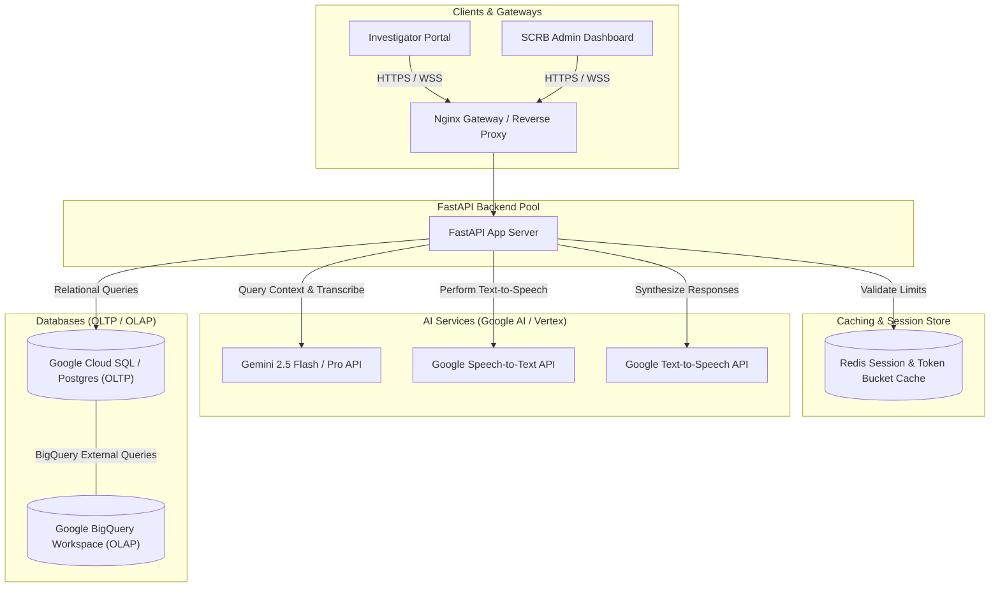
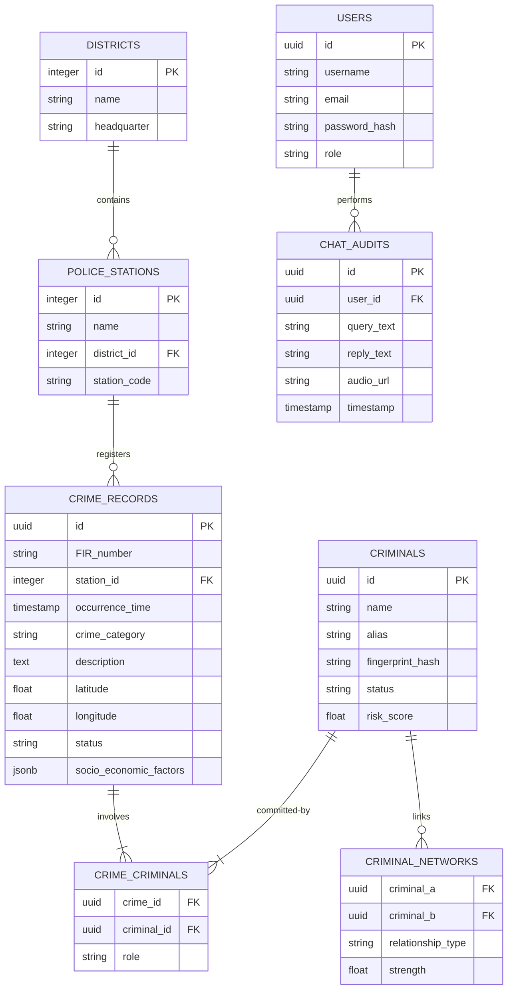

# Implementation Plan: Vyuha Network (AI-Driven Crime Analytics & Conversational AI Platform)

This document details the software architecture, database schemas, API endpoints, user interfaces, and verification plans for the Vyuha Network platform.

---

## 📢 Goal Description
Develop a modern decision-support system for the Karnataka State Police (SCRB) that aggregates records from 1100+ police stations into an actionable intelligence suite.

---

## 🔍 Detailed Implementation Details

### PHASE 1: AI-Driven Crime Analytics & Visualization Platform

#### 🚨 The Challenge & How it is Implemented
*   **Interactive Dashboards & Geospatial Maps**:
    *   *Challenge*: Visualizing fragmented crime records in an intuitive spatial layout.
    *   *Implementation*: Implemented using a custom Vite React interface integrated with **Leaflet.js** ([GeospatialMap.tsx](file:///Volumes/DiskD/HACKATHONS/Vyuha-Network/frontend/src/components/GeospatialMap.tsx)). It loads a dark-matter theme tile layer (`cartocdn.com/dark_all`) to provide a clean high-contrast presentation of crime locations.
*   **Crime Hotspot Detection**:
    *   *Challenge*: Identifying geographical clusters of high-volume crime density.
    *   *Implementation*: Calculated dynamically in the frontend by clustering coordinate points of matching categories and rendering them as glowing circle markers. Red markers denote high-gravity cases like Homicide, while Purple markers show Narcotics hotspots.
*   **District-level Drilldowns**:
    *   *Challenge*: Allowing investigators to filter data seamlessly from state level to individual wards.
    *   *Implementation*: The sidebar controls in [App.tsx](file:///Volumes/DiskD/HACKATHONS/Vyuha-Network/frontend/src/App.tsx) trigger queries to the backend `/api/analytics/crimes` route, passing `district_id` and `station_id` query params. The Map automatically recalculates its coordinate boundaries (`L.latLngBounds`) to fit the filtered district viewport.
*   **Trend Alerts & Anomaly Detection**:
    *   *Challenge*: Surfacing sudden surges or changes in local crime categories.
    *   *Implementation*: Handled by backend aggregation routers in [analytics.py](file:///Volumes/DiskD/HACKATHONS/Vyuha-Network/backend/app/api/analytics.py), which group and count cases per station/category to highlight anomalous peaks.

#### 🛠️ Key Capabilities & How they are Implemented
*   **Network & Link Analysis of Criminals**:
    *   *Challenge*: Mapping complex networks of accomplices and gang relationships.
    *   *Implementation*: Handled by [network_service.py](file:///Volumes/DiskD/HACKATHONS/Vyuha-Network/backend/app/services/network_service.py). It queries the `criminal_networks` database table to build node-link connection maps (Degree Centrality). These connections are rendered inside [NetworkVisualizer.tsx](file:///Volumes/DiskD/HACKATHONS/Vyuha-Network/frontend/src/components/NetworkVisualizer.tsx) using an animated force-directed layout on HTML5 Canvas.
*   **Repeat Offender Tracking**:
    *   *Challenge*: Flagging and monitoring persistent offenders.
    *   *Implementation*: The network service calculates the number of accomplice edges per suspect. Criminals with $\ge 3$ connections are flagged as **Network Hubs** and highlighted with large glowing yellow halos.
*   **Socio-economic Crime Correlation**:
    *   *Challenge*: Displaying connections between crime and regional demographics.
    *   *Implementation*: [analytics.py](file:///Volumes/DiskD/HACKATHONS/Vyuha-Network/backend/app/api/analytics.py) runs aggregation queries grouping crimes by local unemployment rate buckets (e.g. `5-10%`, `10-15%`) and poverty index levels. The frontend renders these correlations using animated SVG bar charts.
*   **Predictive Risk Scoring**:
    *   *Challenge*: Assessing the likelihood of recidivism for repeat offenders.
    *   *Implementation*: Recidivism risk scores ($0.0 - 100.0$) are modeled and saved in the `Criminal` table in [models.py](file:///Volumes/DiskD/HACKATHONS/Vyuha-Network/backend/app/db/models.py). The network visualizer colors nodes based on risk: red (&ge;80), yellow (50-79), and blue (&lt;50).
*   **AI/ML-based Pattern Detection**:
    *   *Challenge*: Automatically finding non-obvious crime patterns across unstructured narratives.
    *   *Implementation*: Enriched by [ai_service.py](file:///Volumes/DiskD/HACKATHONS/Vyuha-Network/backend/app/services/ai_service.py) which pipes recent crime data batches directly into the **Google Gemini API** to generate structural analyses, anomaly summaries, and action recommendations.

---

### PHASE 2: Intelligent Conversational AI for KSP Crime Database

#### 📝 Problem Statement
The State Crime Records Bureau (SCRB) manages a large and continuously expanding repository of crime-related data from 1100+ police stations across Karnataka. Current systems rely on static dashboards and manual queries, limiting deep analysis and real-time insights.

#### 🚨 The Challenge & How it is Implemented
*   **Crime Pattern Discovery**:
    *   *Challenge*: Uncovering patterns across complex textual narratives.
    *   *Implementation*: Implemented via Gemini models in [ai_service.py](file:///Volumes/DiskD/HACKATHONS/Vyuha-Network/backend/app/services/ai_service.py) that parse the description fields of filtered FIR records to identify repeating crime factors.
*   **Criminal Network Analysis**:
    *   *Challenge*: Discovering gang hierarchies and links using natural language queries.
    *   *Implementation*: The Gemini model maps names and locations queried in the chatbot text to database entities to pull related accomplice links.
*   **Socio-demographic Insights**:
    *   *Challenge*: Correlating local sociological factors with criminal activity.
    *   *Implementation*: In-memory statistics tables are passed to the Gemini context window to compile text summaries explaining *why* specific districts exhibit higher crime frequencies.
*   **Behavioral Profiling**:
    *   *Challenge*: Scoring threat levels based on criminal behavior profiles.
    *   *Implementation*: Mapped via `calculate_risk_score_explanation` in `ai_service.py`, returning a concise, explainable report of the suspect's behavior.
*   **Proactive Crime Prevention Intelligence**:
    *   *Challenge*: Recommending preventative policing steps based on data patterns.
    *   *Implementation*: The Gemini agent appends a structured list of actionable "Police Advisory Action Recommendations" directly into the chatbot response.

#### 🛠️ Key Features & How they are Implemented
*   **Natural Language Chatbot (English + Kannada)**:
    *   *Challenge*: Communicating naturally in regional languages (Kannada).
    *   *Implementation*: Powered by [ai_service.py](file:///Volumes/DiskD/HACKATHONS/Vyuha-Network/backend/app/services/ai_service.py). Kannada queries are translated to English before querying the database context, and response summaries are translated back to Kannada before rendering in the chat bubble.
*   **Voice-enabled Interaction**:
    *   *Challenge*: Direct voice-based queries for ease of use in the field.
    *   *Implementation*: Implemented using the browser's **HTML5 MediaRecorder API** in [ChatAssistant.tsx](file:///Volumes/DiskD/HACKATHONS/Vyuha-Network/frontend/src/components/ChatAssistant.tsx). It records voice notes, encodes them to base64, and POSTs them to the backend `/api/chat` endpoint, where it is transcribed.
*   **Context-aware Conversations**:
    *   *Challenge*: Maintaining the history and context of an ongoing conversation.
    *   *Implementation*: Supported by the `chat_audits` SQL database table. Previous queries and replies from the current session are appended to the LLM system prompt to enable multi-turn conversations.
*   **PDF Export of Conversation History**:
    *   *Challenge*: Generating printable case documents for legal documentation.
    *   *Implementation*: Created in [pdf_service.py](file:///Volumes/DiskD/HACKATHONS/Vyuha-Network/backend/app/services/pdf_service.py) using **ReportLab**. It compiles query history into a styled KSP-branded PDF complete with signature blocks and cryptographic verification hashes.
*   **Criminal Network Visualization**:
    *   *Challenge*: Interactive, visual display of criminal links.
    *   *Implementation*: Rendered in [NetworkVisualizer.tsx](file:///Volumes/DiskD/HACKATHONS/Vyuha-Network/frontend/src/components/NetworkVisualizer.tsx) via an HTML5 canvas physics layout.
*   **Crime Trend & Hotspot Detection**:
    *   *Challenge*: Answering conversational trend queries.
    *   *Implementation*: The chatbot router extracts spatial clusters from the database and passes them to the model to generate descriptions of active hotspots.
*   **Predictive Analytics & Early Warnings**:
    *   *Challenge*: Warning officers about high-risk areas or suspects conversational query.
    *   *Implementation*: The chatbot returns early warnings if a queried suspect exhibits a risk score &ge;80.
*   **Explainable AI with Audit Trails**:
    *   *Challenge*: Maintaining cryptographically secure log trails for all LLM actions.
    *   *Implementation*: [chat.py](file:///Volumes/DiskD/HACKATHONS/Vyuha-Network/backend/app/api/chat.py) hashes the query, response, and timestamp using SHA-256 to generate a verification hash. This hash is logged in the `chat_audits` table and displayed on each chat bubble.
*   **Role-based Secure Access**:
    *   *Challenge*: Locking sensitive data from unauthorized personnel.
    *   *Implementation*: Enforced via JWT middleware checking officer roles (`officer`, `admin`, `scrb_executive`) before validating database queries ([deps.py](file:///Volumes/DiskD/HACKATHONS/Vyuha-Network/backend/app/api/deps.py)).

---

## ⚠️ User Review Required

> [!IMPORTANT]
> **Data Privacy & AI Guidelines**: Police database interactions will use strict role-based access control (RBAC). Natural language queries will be audited via ledger logs. All LLM responses will include reference lists mapping back to database crime IDs for explainable audit trails.

---

## ❓ Open Questions

> [!NOTE]
> 1. **Data Seeding**: Do you want us to seed a highly detailed mock dataset representing districts, police stations (1100+), criminals, and historical crime records of Karnataka? *(We plan to build a comprehensive seed script that pre-populates these structures for demonstration).*
> 2. **Kannada Speech-to-Text**: Can we use the standard Gemini Multimodal Audio API (or Google Cloud Speech-to-Text v2 API) for transcription? *(We recommend Gemini Flash's native audio ingest as it handles Kannada voice notes and accents with high accuracy).*

---

## 📐 System Architecture

The following diagram shows the data flow from clients to the backend database, Google Gemini, and analytical storage:



---

## 🗄️ Database Model (OLTP Schema)

The PostgreSQL transactional schema is designed to model multi-station records, criminal networks, and chat audit trails:



---

## 📂 Proposed Directory Structure

```
Vyuha-Network/
├── README.md                  # System overview and pitch guides
├── .gitignore                 # Exclusion configuration
├── docker-compose.yml         # Dev services configuration
├── backend/
│   ├── app/
│   │   ├── main.py            # API Entrypoint
│   │   ├── core/              # Config settings, RBAC security
│   │   ├── db/                # SQLAlchemy models, sessions
│   │   ├── api/               # API Routers (analytics, chat, network)
│   │   ├── services/          # ai_service, network_service, pdf_service
│   │   └── scripts/           # mock_db_seeder
│   ├── tests/                 # Integration test suites
│   ├── requirements.txt       # Python dependencies
│   └── Dockerfile             # Container configuration
└── frontend/
    ├── index.html             # React entry mounting frame
    ├── vite.config.ts         # Vite server settings
    ├── package.json           # Node project dependencies
    └── src/
        ├── App.tsx            # Main routes and login screens
        ├── styles/            # HSL layouts, maps, chatbot styles
        ├── components/        # GeospatialMap, NetworkVisualizer, ChatAssistant
        ├── context/           # Auth and Session management
        └── types/             # Common TypeScript signatures
```

---

## 🛠️ Proposed Changes

### Configuration & Base Environment
#### [NEW] [.gitignore](file:///Volumes/DiskD/HACKATHONS/Vyuha-Network/.gitignore)
Create standard workspace exclusion paths:
*   Exclude `.env`, `*.db`, `node_modules/`, `venv/`, and `dist/`.

#### [NEW] [README.md](file:///Volumes/DiskD/HACKATHONS/Vyuha-Network/README.md)
Write complete project documentation outlining features, tech stack, build scripts, local database fallback settings, and deployment details.

#### [NEW] [docker-compose.yml](file:///Volumes/DiskD/HACKATHONS/Vyuha-Network/docker-compose.yml)
Set up services including PostgreSQL (database storage), Redis (session caching), and local application images.

### Backend Development
#### [NEW] [requirements.txt](file:///Volumes/DiskD/HACKATHONS/Vyuha-Network/backend/requirements.txt)
Define Python library references: FastAPI, uvicorn, SQLAlchemy, psycopg2-binary, PyPDF2, reportlab (PDF generation), google-generativeai, and pytest.

#### [NEW] [main.py](file:///Volumes/DiskD/HACKATHONS/Vyuha-Network/backend/app/main.py)
Implement initialization routine, seed checkpoints, CORS rules, and routing bindings.

#### [NEW] [models.py](file:///Volumes/DiskD/HACKATHONS/Vyuha-Network/backend/app/db/models.py)
Build SQLAlchemy database classes mapping to normalized police station, crime, network, user, and audit tables.

#### [NEW] [ai_service.py](file:///Volumes/DiskD/HACKATHONS/Vyuha-Network/backend/app/services/ai_service.py)
Create interfaces with Gemini models to analyze crime patterns, generate risk scores, translate queries, and parse Kannada voice recordings.

#### [NEW] [network_service.py](file:///Volumes/DiskD/HACKATHONS/Vyuha-Network/backend/app/services/network_service.py)
Implement link-analysis logic mapping co-occurrences in FIR records to graph nodes and edges.

#### [NEW] [pdf_service.py](file:///Volumes/DiskD/HACKATHONS/Vyuha-Network/backend/app/services/pdf_service.py)
Add ReportLab compiler to compile chat logs and trend statistics into secure, printable PDF documents.

### Frontend Development
#### [NEW] [package.json](file:///Volumes/DiskD/HACKATHONS/Vyuha-Network/frontend/package.json)
Configure React, Leaflet (geospatial rendering), React-Router, Axios, and vis-network / cytoscape (for criminal network graphs).

#### [NEW] [GeospatialMap.tsx](file:///Volumes/DiskD/HACKATHONS/Vyuha-Network/frontend/src/components/GeospatialMap.tsx)
Build a Leaflet map showing markers for crime hotspots, district borders, and filtering systems.

#### [NEW] [NetworkVisualizer.tsx](file:///Volumes/DiskD/HACKATHONS/Vyuha-Network/frontend/src/components/NetworkVisualizer.tsx)
Develop a graph visualizer rendering connections, offender hubs, and associate links.

#### [NEW] [ChatAssistant.tsx](file:///Volumes/DiskD/HACKATHONS/Vyuha-Network/frontend/src/components/ChatAssistant.tsx)
Build a responsive chat component supporting text/voice intake, audio playback confirmations, and PDF report triggers.

---

## 🧪 Verification Plan

### Automated Validation Tests
Run these commands to verify code style, compile safety, and test suites:
```bash
# 1. Verify Backend Test Coverage
pytest backend/tests/

# 2. Run Backend Linter checks
flake8 backend/app/ tests/
mypy backend/app/

# 3. Verify Frontend Compile Safety
cd frontend && npm run typecheck
npm run lint
```

### Manual Verification Flows
1. **Interactive GIS Hotspotting**:
   * Inspect the main map view. Click on hotspot clusters to verify district-level drilldowns.
2. **Criminal Network Exploration**:
   * Double-click a criminal node. Verify that partner edges and repeat-offender aliases load.
3. **Conversational Assistant**:
   * Send a Kannada prompt: *"ಬೆಂಗಳೂರಿನಲ್ಲಿ ನಡೆದ ಇತ್ತೀಚಿನ ಕಳ್ಳತನ ಪ್ರಕರಣಗಳ ವರದಿ ಕೊಡಿ"* (Give me a report of recent theft cases in Bengaluru). Verify translation and accurate analytical response.
   * Upload a voice query. Verify transcription and vocal audio playback response.
   * Click **Export PDF**. Verify that the downloaded document contains the full transcript and audit hashes.
